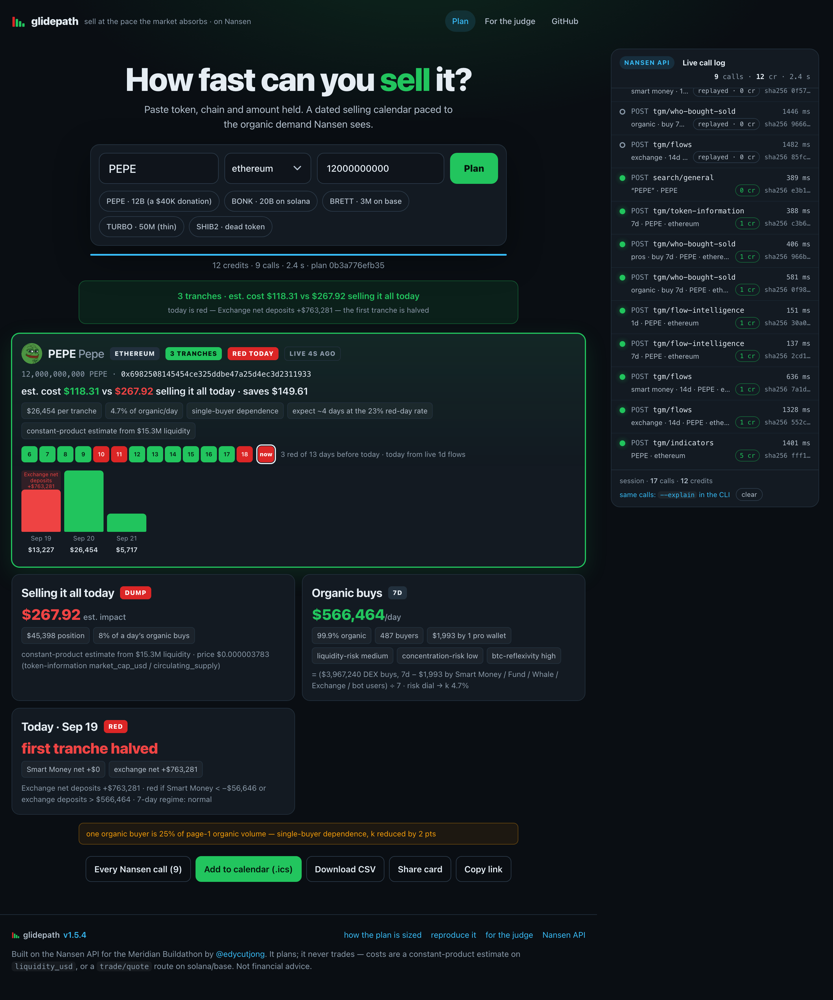
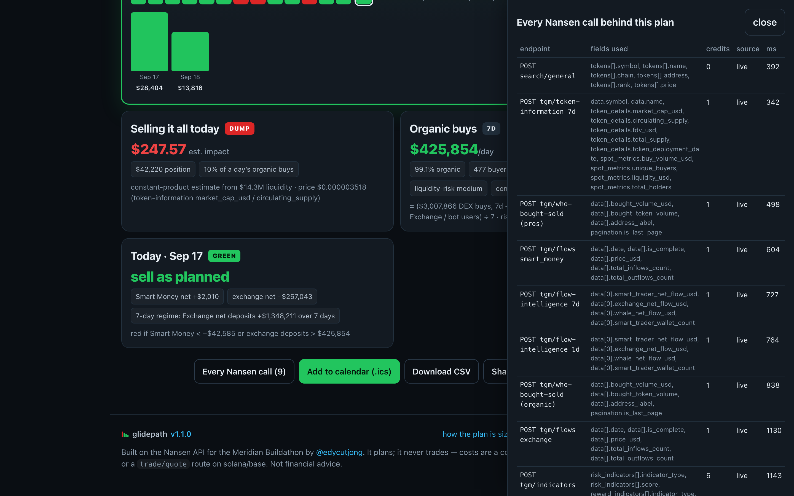
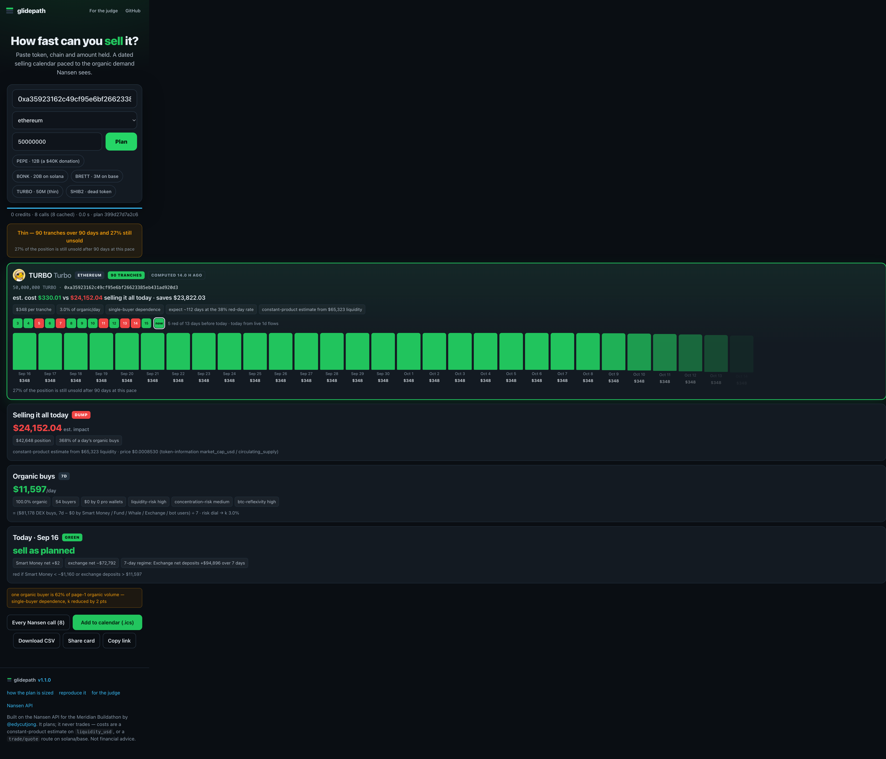
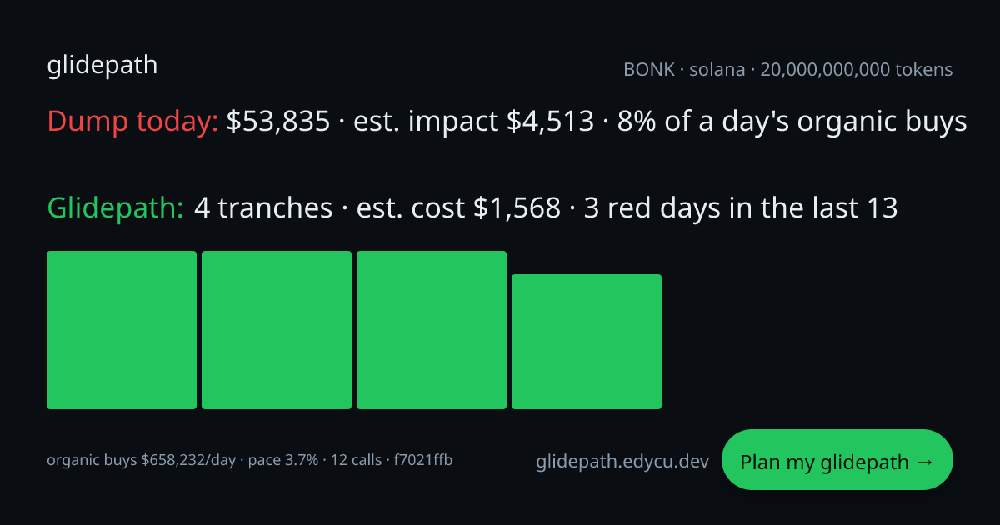
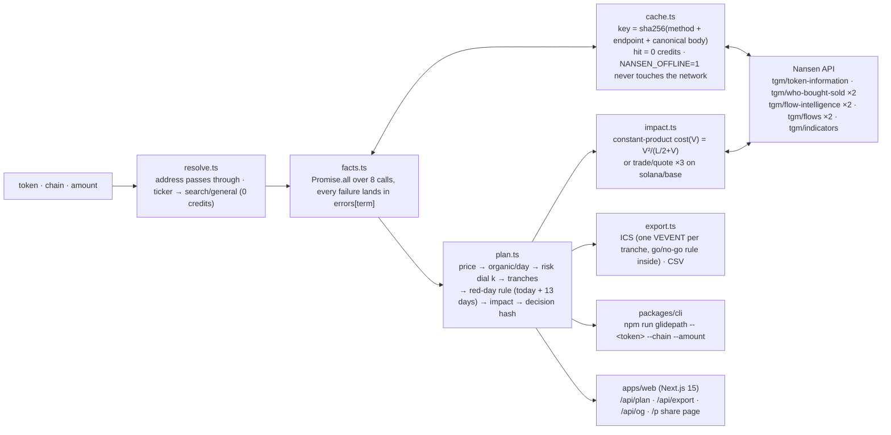

<div align="center">
  <h1>Glidepath 🛬</h1>
  <p><em>You have to sell a token you never meant to own. Glidepath turns it into a dated selling calendar sized to the market's organic demand — so you are never the biggest seller on a day the pros are exiting.</em></p>
  

  <p>It plans. It never trades. 12 credits per plan on EVM chains, 15 on solana/base, 0 on a cache hit — and the 13 recorded plans replay offline byte-for-byte with zero network calls and zero credits (<code>npm run verify</code>).</p>

  <br/>

  [](https://glidepath.edycu.dev)
  [](https://glidepath.edycu.dev/judge)
  [](https://nansen.ai/campaigns/meridian-buildathon)

  <br/>

  
  
  
  
  
  
  [](LICENSE)
  [](https://github.com/edycutjong/glidepath/actions/workflows/ci.yml)
  [](https://github.com/edycutjong/glidepath/releases/latest)

  <br/>

  [JUDGE.md](JUDGE.md) · [DEMO.md](DEMO.md) · [SCORING.md](docs/SCORING.md) · [DX-REPORT.md](docs/DX-REPORT.md) · [ARCHITECTURE.md](ARCHITECTURE.md)

</div>

---

## 📸 See it in Action

A **red today** — BONK, exchange net deposits flagged by `tgm/flow-intelligence`, first tranche halved, real `trade/quote` route costs:


| | |
|---|---|
|  |  |
|  | |

## 💡 The Problem & Solution

### The Problem

A nonprofit's finance officer receives a $40K memecoin donation. A freelancer is paid in a project's token. They have never used a DEX, and they must turn the tokens into dollars without crashing the price or competing with the funds on the day the funds are dumping.

### The Solution

Paste **token · chain · amount held**. Glidepath:

1. Computes **organic daily buy volume** — DEX buys over the last 7 days by wallets that carry **none** of Nansen's Smart Money / Fund / Whale / Exchange / sniper-bot labels — via `tgm/who-bought-sold` label filters and `tgm/token-information`.
2. Prints the **dump-today line**: position value, estimated impact, and what share of a full day's organic buying you would be.
3. Sizes daily **tranches** to `k` × organic/day, where `k` slides from 10 % to 3 % as Nansen's peer-percentile risk indicators rise (`tgm/indicators`), capped at 1 % of `liquidity_usd`.
4. Flags **red days**: today from `tgm/flow-intelligence` (Smart Money net-selling, or net deposits to exchanges), the 13 complete days before it from `tgm/flows` daily cohort history (a 14-day strip with today). A red today halves the first tranche; the observed red-day rate stretches the expected finish.
5. Shows **dump today vs glidepath cost** — constant-product from `liquidity_usd`, or a real routed `trade/quote` on solana/base, labelled as such.
6. Exports the plan as **ICS** (one calendar event per tranche, with the go/no-go rule inside) and **CSV**, plus a share card with an OG image.
7. Opens a **provenance drawer**: every Nansen call, the fields used, credits (from Nansen's response headers), cached or live, ms — and a "computed Ns ago" badge.

It plans. It never trades.

## 🏗️ Architecture & Tech Stack

One plan is `resolve → facts → computePlan → applyQuotes`; the plan is a pure function of `(facts, input, now)`, so a recorded fixture replays to the same calendar dates, the same red history and the same decision hash. Full module map and data flow: [ARCHITECTURE.md](ARCHITECTURE.md).



| layer | what | where |
|---|---|---|
| Engine | TypeScript. `NansenClient`: token bucket (8 rps), per-call timeout, 1 retry on 429/5xx/timeout honouring `Retry-After`, credits read from response headers; `CachedNansenClient` read-through cache (1 h TTL on the web, failures never cached) | `packages/core` |
| CLI | `npm run glidepath -- <token> --chain <chain> --amount <n>` with `--json --explain --ics --csv --no-cache --no-quotes` | `packages/cli` |
| Web | Next.js 15 App Router, plain CSS, server-side key; memory + `/tmp` disk cache on Vercel; OG card 1200×630 | `apps/web` |
| Data | Nansen API — 7 endpoints · 11 calls per plan (table below) | `packages/core/src/nansen.ts` |
| Proof | 231 vitest tests (60,000 fast-check property cases on the planner, key-boundary tests) · 13 recorded fixtures replayed offline · 42 Playwright checks on the built app · `bench.ts` p50/p95 · `check_submission_readiness.ts` | `packages/core/test`, `apps/web/test`, `e2e/`, `fixtures/`, `scripts/` |
| CI | GitHub Actions, 7 stages, no key anywhere: quality (prettier, eslint, tsc ×2, vitest + coverage, offline verify, readiness) → security (TruffleHog, npm audit, licenses) → build + bundle budget → Playwright E2E → Lighthouse → deploy gate → Vercel production deploy (prebuilt, `main` only); CodeQL, gitleaks (full history), Dependabot, semantic releases alongside | `.github/workflows/` |

## 🏆 Nansen Integration

The data drives the logic — every on-screen number traces to a named Nansen field.

| endpoint | credits | fields used | what it drives |
|---|---|---|---|
| `search/general` | 0 | `tokens[].symbol/name/chain/address/rank` | ticker → address on the chosen chain; "exists on other chains" when not |
| `tgm/token-information` (7d) | 1 | `market_cap_usd`, `circulating_supply`, `buy_volume_usd`, `unique_buyers`, `liquidity_usd`, `total_holders`, `total_supply` | price, total DEX buys, liquidity cap, impact model, sanity warnings |
| `tgm/who-bought-sold` BUY 7d, `include_smart_money_labels` = pro labels | 1 | `data[].bought_volume_usd`, `address_label` | the pro share subtracted from total buys → **organic/day** |
| `tgm/who-bought-sold` BUY 7d, `exclude_smart_money_labels`, page 1 of 1000 | 1 | `data[].bought_volume_usd` | single-buyer dependence (top organic buyer > 25 %) → k − 2 pts |
| `tgm/flow-intelligence` 1d | 1 | `smart_trader_net_flow_usd`, `exchange_net_flow_usd` | **is today red** (halve tranche 1) |
| `tgm/flow-intelligence` 7d | 1 | same | **7-day regime** — a week of net-selling past 3× the daily thresholds, shown beside today |
| `tgm/flows` label `smart_money`, 14d | 1 | `date`, `is_complete`, `price_usd`, `total_inflows_count`, `total_outflows_count` | daily Smart Money net flow → red-day history |
| `tgm/flows` label `exchange`, 14d | 1 | same | daily exchange net deposits → red-day history and rate |
| `tgm/indicators` | 5 | `liquidity-risk`, `concentration-risk`, `btc-reflexivity` scores | the participation rate `k` (10 % → 3 %) |
| `trade/quote` ×3 (solana, base) | 1 each | `toTokenDecimals`, `inUsdValue`, `outUsdValue`, `priceImpactPct` | real routed cost of one tranche and of the whole bag |

12 credits per plan on EVM chains, 15 on solana/base, 0 on a cache hit. Formulas with the real PEPE numbers: [docs/SCORING.md](docs/SCORING.md).

### Why only Nansen

"Organic demand" is a **who**, not a **how much**. An RPC node or an explorer gives you volume; it cannot tell you which buyers are funds, Smart Money, exchanges or sniper-bot users. On Nansen that split exists as a server-side label filter on `tgm/who-bought-sold` — and the spike showed the filter acts on labels the row's `address_label` does not even display, so there is no client-side substitute. The red-day rule needs **cohort** net flows (`tgm/flows`, `tgm/flow-intelligence`); the risk dial needs **peer-percentile** scores (`tgm/indicators`); the route quote needs an aggregator that returns decimals with the price (`trade/quote`). Remove Nansen and Glidepath degrades to a TWAP calculator on raw volume — exactly the number a forced seller must not trust.

### Impact-model caveat

The constant-product estimate treats `liquidity_usd` as one pool with the token on one side. It is optimistic for tokens whose depth sits in a single thin pool, and it ignores MEV and gas. On solana and base the routed `trade/quote` replaces it and the label changes to "route quote". Not financial advice.

## 📊 Engineering Rigor

| metric | value | how to reproduce |
|---|---|---|
| tests | **231 vitest tests**, green — 12 of them regression tests named for the defect each pins | `npm test` |
| spend guard | public route capped at **6 requests/min per address** (429) and **3,000 live credits/day** (honest 503 past it, before any Nansen call) | `apps/web/lib/guard.ts`, `apps/web/test/guard.test.ts` |
| property-based verification | **60,000 generated cases** (fast-check, 6 properties × 10,000) on the tranche planner — found and fixed one real defect | `npm test` (`plan.property.test.ts`) |
| key boundary | the `nsn_` key never reaches a client: engine JSON/ICS/CSV, the route handler, the built pages — all asserted key-free; validation runs before any fetch | `npm test` + `npm run e2e` |
| E2E | **42 Playwright checks** (21 tests × chromium + Pixel 7) against the production build with no key | `npm run e2e` |
| fixtures | **13 recorded, 13/13 reproduced offline** — zero network calls, zero credits | `npm run verify` |
| bench, cold (fresh cache, live Nansen) | **p50 3.5 s / p95 6.0 s** | `npm run bench` (7 tokens × 3 runs) |
| bench, warm (second call, same cache) | **p50 5 ms / p95 356 ms** | same |
| credits / plan | **13.0** (bench average; 12 on EVM, 15 on solana/base, 0 on a cache hit) | same |
| calls / plan | 9.3 | same |
| who-bought-sold pages / plan | 2.0 | same |
| failed calls | 7 of 195 (6 deterministic: `tgm/flows` refuses stablecoins) | same |
| readiness | `npm run check` — files, secrets, kitchen leaks, fixtures, verify, tests, README claims | `npm run check` |

- **231 vitest tests** (`npm test`): tranche-sizing table, red-day rule, risk dial vs indicator scores, impact model, decision-hash stability, pagination cap (the 20,000-buyer case), cache and offline mode, client retries/timeouts/header credits, ICS/CSV, resolver, end-to-end on a fake Nansen, one replay test per fixture — and three high-signal categories:
  - **12 regression tests, each named for the defect it pins** (`qa round …`, `regression (…)`): the one-tranche "expect ~2 days" copy, the ICS `\;` no-op, the error body cut mid-word, the FLOKI empty symbol, `liquidity_usd = 0`, the 7-day regime that was fetched but never shown, the echoed-key redaction, the zero-token tranche.
  - **One property-based verification, 60,000 generated cases** (`packages/core/test/plan.property.test.ts`, fast-check, 6 properties × 10,000 runs): Σ tranches + remainder = amount held; every tranche ≤ k × organic/day and ≤ 1 % of liquidity; a red today halves tranche 1 and only tranche 1; consecutive UTC dates, ≤ 90 of them, expectedDays ≥ days ≥ 1; the decision hash is deterministic and invariant to timing and context fields. Run 1 found a real defect — a liquidity cap underflowing at a dust price produced 90 tranches of zero tokens — now a guarded, fully-unsold `thin` plan with its own regression test.
  - **Key-boundary tests** (`packages/core/test/boundary.test.ts`, `apps/web/test/api-boundary.test.ts`, `e2e/`): the server key travels in one request header and nowhere else — plan JSON, provenance, ICS/CSV, the route handler's 400/500 bodies and the built pages are asserted free of `nsn_`; an upstream body that echoes the key is redacted; `/api/plan` validates input before the key check and before any `fetch`.
- **13 fixtures, 13/13 reproduced offline** (`npm run verify`): each stores the raw Nansen responses byte-for-byte, the plan and the clock; replay must match the hash with zero network calls and zero credits.
- **Bench** (`npm run bench`, 7 tokens × 3 runs): cold **p50 3.5 s / p95 6.0 s**, warm **p50 5 ms / p95 356 ms**, **13.0 credits/plan**, 9.3 calls/plan, 2.0 who-bought-sold pages/plan, 7 of 195 calls failed (6 deterministic: `tgm/flows` refuses stablecoins). Full table and reproduce steps: [DEMO.md](DEMO.md).

**Every number traces to a named Nansen field** — the provenance drawer and `--explain` list them per call. Nothing is estimated silently; when a call fails, the term is null, the warning names the endpoint, and the plan degrades (no history strip, no route quote, k treated as medium) instead of inventing a value. **Honest states**: no organic demand (< $50/day or < 5 buyers) → "there is nobody to sell to at any pace", numbers shown, no calendar. Calendar beyond 90 days → "N % still unsold after 90 days". Ticker unknown on the chain → the chains where it exists.

### Honest limits (12)

1. **The impact model is an approximation** — see the [caveat](#impact-model-caveat): one pool, token on one side, optimistic for a single thin pool, no MEV or gas. Only solana/base get a real route quote.
2. **The pro share is small.** On the 11 tokens tried, Smart Money / funds / whales / exchanges were 0–3.6 % of DEX buys — Glidepath shows that split rather than dramatising it ([DX-REPORT.md](docs/DX-REPORT.md)).
3. **Future days cannot be known red or green.** Today is live; the 13 complete days before it are real; each ICS event carries the rule to re-check on the morning.
4. **A well-formed but nonexistent address still spends 12 credits** — the parallel fan-out in `facts.ts` has no existence gate before it; the plan comes back `no-price` with no crash (independent review 2026-09-16, left as is: gating on `token-information` would serialise the hero path).
5. **The 12 s organic-breadth timeout is the wall-time ceiling on a slow Nansen day** — it timed out once during review (plan took 14.8 s, shown as a red "failed: timeout" row in provenance, "concentration not applied"); not a crash, but visible (independent review 2026-09-16).
6. **`/p` and `/api/export` have no try/catch** — only a missing server key can throw there (independent review 2026-09-16).
7. **Bug found and fixed — one-tranche plans said "fits in one day" beside "expect ~2 days at the 15 % red-day rate".** `expectedDays` is now 1 when today's colour is already known; regression in `packages/core/test/plan.test.ts` (independent review 2026-09-16).
8. **Bug found and fixed — ICS escaping was a no-op (`"\;"`) so `;` was never escaped, and content lines were not folded at 75 octets (RFC 5545).** Both fixed without splitting UTF-8; regression in `packages/core/test/export.test.ts` (independent review 2026-09-16).
9. **Bug found and fixed — Nansen JSON error bodies were cut mid-word on screen ("…is a st").** The body's `message` is now surfaced as a sentence ("…is a stablecoin. The TGM flows endpoint…") (independent review 2026-09-16).
10. **Bug found and fixed — `seed --rederive` overwrote the USDC fixture's live 422 reason with an offline-cache-miss string.** The script now preserves recorded `errors`; the fixture was restored from the original recording (independent review 2026-09-16).
11. **Bug found and fixed — the share-page "computed Ns ago" badge hydrated with a server clock (server/client mismatch)**, and CLI `--explain` did not label who-bought-sold rows as (pros)/(organic). Both fixed (independent review 2026-09-16).
12. **Docs bug found and fixed — the history strip was described as "the last 14 days".** Nansen's `tgm/flows` `from` is exclusive, so it is 13 complete days + live today (14 cells); wording fixed here and in SCORING.md (independent review 2026-09-16).

## 🚀 Getting Started

### Prerequisites

- Node ≥ 20
- `NANSEN_API_KEY` — an `nsn_…` key from https://app.nansen.ai/api. Only the live steps need it; without a key, `npm run verify` replays the 13 recorded plans offline.

### Installation

Quickstart — runs in under 10 minutes:

```bash
git clone https://github.com/edycutjong/glidepath && cd glidepath   # 0:10
npm install                                                          # 0:40  (Node ≥ 20)
export NANSEN_API_KEY=nsn_...                                        # from https://app.nansen.ai/api
npm run glidepath -- PEPE --chain ethereum --amount 12000000000      # 0:05  → the plan, 12 credits
npm run dev                                                          # 0:20  → http://localhost:3000, click "PEPE · 12B"
```

Timed on a clean clone (macOS, Node 22, warm npm cache, 2026-09-16): clone + `npm install` 8 s, first live plan 2 s, `npm run verify` 1 s, web build 12 s — under a minute; budget 10 minutes on a cold npm cache and a slow link. Without a key, `npm run verify` replays the 13 recorded plans offline.

CLI flags: `--json` (full plan + provenance) · `--explain` (every tranche and every call) · `--ics plan.ics` · `--csv plan.csv` · `--no-cache` · `--no-quotes`.

## 🧪 Testing & CI

**7-stage pipeline:** Quality → Security → Build → E2E → Performance → Deploy gate → Production Deploy (prebuilt `vercel deploy` to glidepath.edycu.dev, `main` only, after every gate) — no Nansen key anywhere; the only secret is `VERCEL_TOKEN`. The product is only exercised live by a human with a key.

```bash
# ── Code Quality ────────────────────────────
npm run lint          # ESLint (flat config, TS + React hooks)
npm run format:check  # Prettier
npm run typecheck     # engine + CLI + scripts   ·   npm run typecheck:web
npm test              # 231 vitest tests incl. 60,000 property cases
npm run test:coverage # + v8 coverage (≈ 93 % lines on the engine and API)
npm run verify        # 13/13 recorded plans replay offline — no key, no network, 0 credits
npm run check         # submission-readiness audit (files, secrets, kitchen leaks, fixtures, verify, tests, README claims)
npm run ci            # audit + format + lint + typecheck ×2 + coverage + verify + check

# ── Advanced Testing ────────────────────────
npm run e2e           # Playwright, 4 suites × chromium + Pixel 7, built app, no key
npm run e2e:ui        # Playwright interactive mode
npm run lighthouse    # Lighthouse CI on / and /judge (a11y ≥ 0.9 is a hard gate)
npm run ci:full       # ci + next build + e2e

# ── Security / live ─────────────────────────
npm run audit         # npm audit on production dependencies (high+)
npm run bench         # live, ~270 credits for 7 tokens × 3 runs
```

| Layer | Tool | Status |
|---|---|---|
| Code Quality | ESLint 9 (typescript-eslint, react-hooks) + Prettier + tsc (engine, web) | ✅ |
| Unit Testing | vitest, 231 tests, v8 coverage ≈ 93 % lines | ✅ |
| Property-based | fast-check — 60,000 generated cases on the tranche planner | ✅ |
| Key boundary | engine + route handler + built pages asserted `nsn_`-free | ✅ |
| Offline proof | 13/13 fixtures replay byte-for-byte (`verify`) | ✅ |
| E2E Testing | Playwright — 4 suites (home, plan flow, responsive, /judge), 42 checks, no key | ✅ |
| Security (SAST) | CodeQL (javascript-typescript) | ✅ |
| Security (SCA) | Dependabot (4 npm manifests + actions, grouped monthly, no majors) + npm audit + license-checker | ✅ |
| Secret Scanning | TruffleHog (verified only) + gitleaks (full history) + `npm run check` history grep | ✅ |
| Performance | Lighthouse CI (advisory), bundle budget 1.5/2 MB | ✅ |
| Releases | Semantic versions from conventional commits (`release.yml`), v1.0.0 → v1.1.0 tagged by the workflow | ✅ |
| Community | CoC · Contributing · Security policy · issue + PR templates | ✅ |

## 📁 Project Structure

```
packages/core   engine (client, cache, facts, plan, impact, export, fixtures)   packages/cli   the CLI
apps/web        Next.js 15 planner (/api/plan, /api/export, /api/og, /p)       scripts/       spike · seed · verify · bench · check
fixtures/       13 recorded live runs                                           docs/          SCORING.md · DX-REPORT.md · screenshots
e2e/            Playwright suites (no key)                                      JUDGE.md       the /judge page, mirrored for the repo reader
```

## 📽️ Demo Materials

- **Live:** https://glidepath.edycu.dev — no wallet, no account; five example chips (PEPE · BONK · BRETT · TURBO · SHIB2), ICS/CSV export, share card with OG image.
- **Reproduce every number:** [DEMO.md](DEMO.md) — the recorded PEPE plan, offline replay, tests, bench table, re-recording the fixtures, the day-one spike, and the credits spent.
- **Formulas with the real PEPE numbers:** [docs/SCORING.md](docs/SCORING.md) · **API findings from the spike:** [docs/DX-REPORT.md](docs/DX-REPORT.md).

## 📄 License

MIT — see [LICENSE](LICENSE). Built for the Nansen Meridian Buildathon (Sep 2026) by [@edycutjong](https://x.com/edycutjong).
